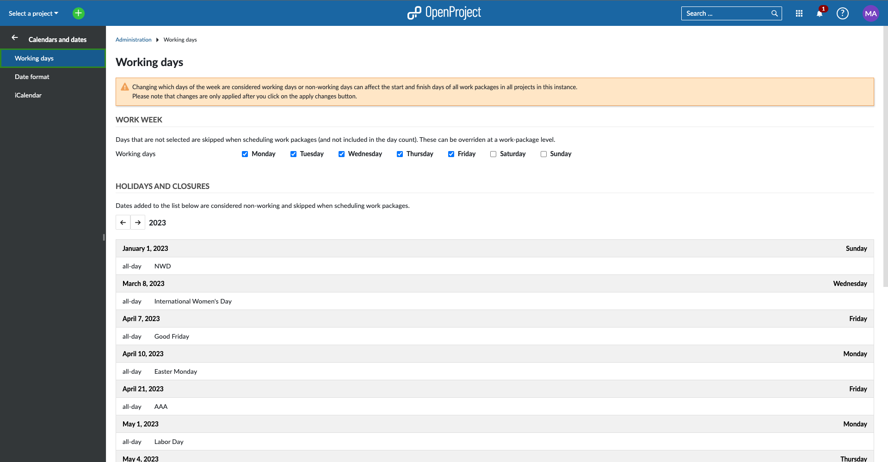
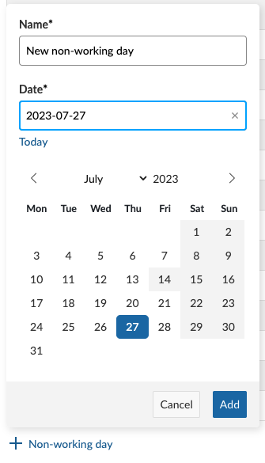

---
sidebar_navigation:
  title: Calendar and dates
  priority: 940
description: Configure working days, dates formats and calendar subscriptions
keywords: working non-working days work week dates calendars icalendar
---
# Calendar and dates

Configure working days, dates formats and calendar subscriptions.

Navigate to **Administration → Calendar and dates**.

| Topic                                             | Content                                                      |
| ------------------------------------------------- | ------------------------------------------------------------ |
| [Workign days](#working-days)                     | Define which days of the week are considered working days for scheduling and calculation of duration. |
| [Date format](#date-format)                       | Change time and date formats.                                |
| [Calendar subscriptions](#calendar-subscriptions) | Allow users to subscribe to calendars.                       |

## Working days

Administrators are able to define which days of the week are considered working days at an instance level. In other words, this setting defines what OpenProject should consider to be a normal work week when scheduling work packages.

To change this setting, navigate to **Working days** inside of the **Calendar and dates** settings.

> **Note:** By default, the five days from Monday–Friday are considered working days, and Saturday and Sunday are considered non-working.

To change this setting, unselect days that you would like to define as non-working, and select ones that you would like to consider working, and click on **Save**.

### Specific non-working days

You can also designate specific dates (such as national or local holidays) as non-working days. Work packages in regular scheduling mode will skip these days and they will not be included when calculating duration.

Click on **+ Non-working day** to add a new date to the list. In the date picker modal that appears, give this new non-working day a name and select the specific date you would like to add. Click on **Add**. This day will now be a non-working day for all users of the instance.

Click on **Apply changes** at the end of the page for the changes to take effect.

### Effect on scheduling

As an instance-level setting, any change here will affect the scheduling of *all work packages* in *all projects* in that instance. It is currently not possible to define working days at a project-level. 

However, it *is* possible to override this setting at the level of individual work packages via the date picker. For more information on how to schedule work packages on non-working days, refer to [Duration and Non-working days in the user guide](../../user-guide/work-packages/set-change-dates/#working-days-and-duration).

> **Important:** Changing this setting will reschedule work packages automatically to the next available working day after clicking on **Save**. For example, removing Friday as a working day by unchecking it will mean that work packages that included Friday will now end one day in the future, and ones that started or ended on Friday will now start and end on Monday. 
>
> Depending on the number of projects and work packages in your instance, this process can take from a couple of minutes to hours. 

Changing this setting is likely to cause changes to scheduling in unexpected ways, and generate a significant number of notifications for assignees, responsibles and watchers for work packages whose dates change as a result. 

We only recommend changing this setting if you are absolutely sure and you are aware of the potential consequences.

### Effect on calendars

The non-working days defined here are coloured differently, generally with a darker background colour, on the [work package date picker](../../user-guide/work-packages/set-change-dates/#working-days-and-duration), [Gantt chart](../../user-guide/gantt-chart/) and the [Team planner](../../user-guide/team-planner/) and [calendar](../../user-guide/calendar/) modules.

## Date format

Administrators are able to change the default time and date formats in OpenProject. This affects how calendars and dates are calculated and displayed.

To change this setting, navigate to **Date format** inside of the **Calendar and dates** settings.

1. **Date**: default is based on user's language. You can choose various formats to display dates in the system.
2. **Time**: default is based on user's language. You can choose various formats to display time in the system.
3. **Week starts on**: Configure what date the week starts (e.g. in the calendar view). Default is `Based on user's language`.
   You can also choose to start a week always on Monday, Sunday or Saturdays.
   If you set Week starts on, you must also set the First week in year or will probably get inconsistencies in week numbering in calendars and the Gantt chart.
4. **First week in year contains**: Select the day that needs to be contained in the first week of the year. This value is used together with _Week starts on_ to determine the first week of the year. 
   - For European ISO-8601 standard, set Week starts on to `Monday` and First week in year to `Thursday`.
   - For US and Canada, set Week starts on to `Sunday` and Day of Year to `6`.
   - If you leave both on `Based on user's language`, the information provided by moment.js will be used: For more information, please also see [this document from moment.js](https://momentjscom.readthedocs.io/en/latest/moment/07-customization/16-dow-doy/).
   - For more information on the way the first week of the year is computed according to ISO standards, see [wikipedia](https://en.wikipedia.org/wiki/ISO_week_date#First_week)
5. Do not forget to **save** your changes.

> **Info:** Configuration options related to aggregation time (the time interval in which different user activities are displayed as one set of actions) have been moved to the [Emails and notifications](../emails-and-notifications/) section.

## Calendar subscriptions

Administrators can allow users with the necessary permissions to subscribe to OpenProject calendars and access work package information via an external calendar client using iCalendar. When the setting **Enable iCalendar subscriptions** is inactive nobody will be able to subscribe to any calendar.

To change this setting, navigate to **Calendar subscriptions** inside of the **Calendar and dates** settings.

