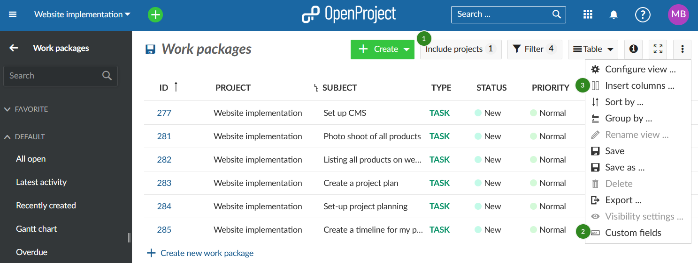
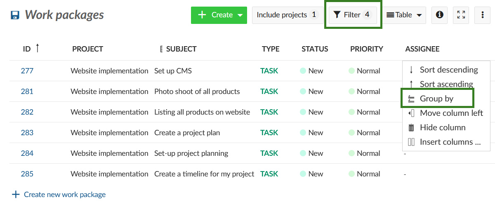
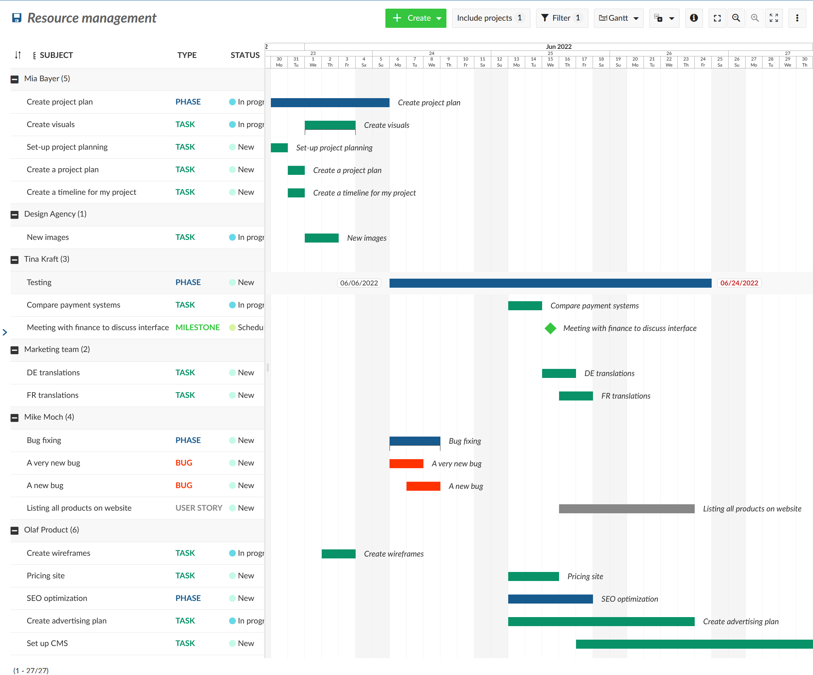
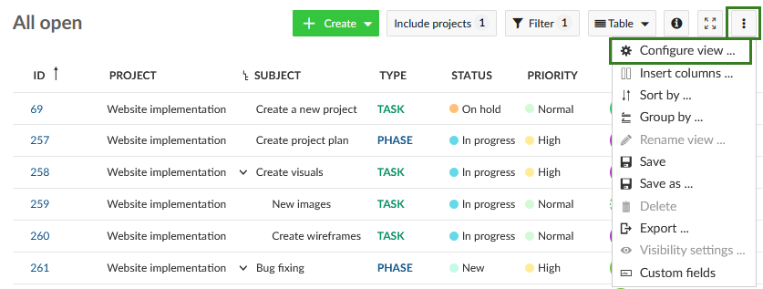
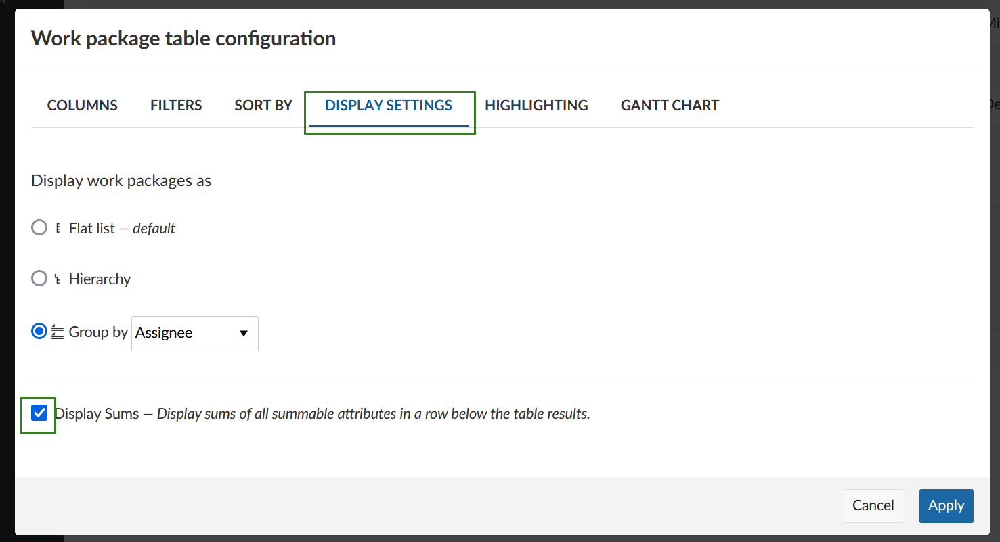

---
sidebar_navigation:
  title: Resource Management
  priority: 990
description: Step-by-step instruction about resource management
keywords: use-case, resource management
---

# Use Case: Resource Management

**Note:** This is a workaround. OpenProject does not have the automated functionality to provide detailed resource management or employee work capacity calculations.

Step 1: Select a project and go to the work package overview. If you would like to create an overview over multiple projects, select the respective projects and/or subprojects in the **Include projects** menu between the **+ Create** and the **Filter** buttons. 

​		Alternatively, you can also chose the **Global work package overview** by selecting the **Waffle button** in the top right:

Step 2: Either use existing fields, **Estimated time** and **Spent time**, or [create custom fields](../../system-admin-guide/custom-fields/) (i.e. **Est. Scope (h)** and **Time spent (h)**).

Step 3: Either insert the standard fields to the view, or insert the custom fields if created in Step 2.

Step 4: Then sort and filter all work packages and group by assignee. 

Step 5: Save your view.

You could also add the Gantt view to add an additional dimension to your overview.

This will provide a rough overview of the various tasks assigned to a specific person or team. Adding the Gantt view provides a supplementary overview of when these tasks are scheduled. It is a visual way of looking at approximately how many tasks are assigned to an individual. This view gives you an estimate about the timeline, allowing for adjustments in assignments and timing to be made to balance your resources. 

These functions can help focus in on showing relevant results only. Using filters and the (+) zoom function will help to focus the Gantt view to only the tasks that are scheduled for example for the next 30 days. 

You can also use the sum function. Select **[⋮]** -> ***Configure view*** -> ***Display settings*** -> and check ***Display Sums*** box:

 

**Limitations:** While this workaround provides a visual estimate of who works on what and when, it does not replace a dedicated capacity management tool.
