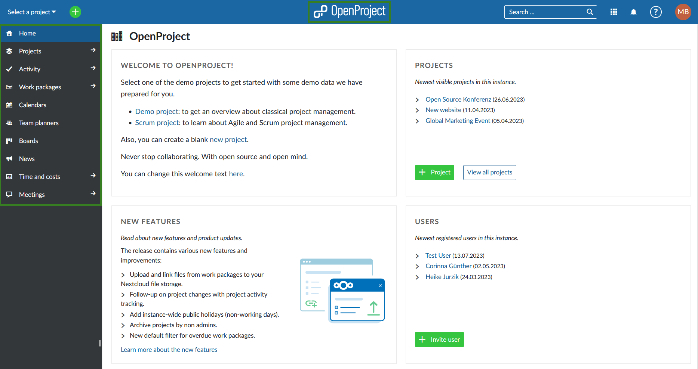
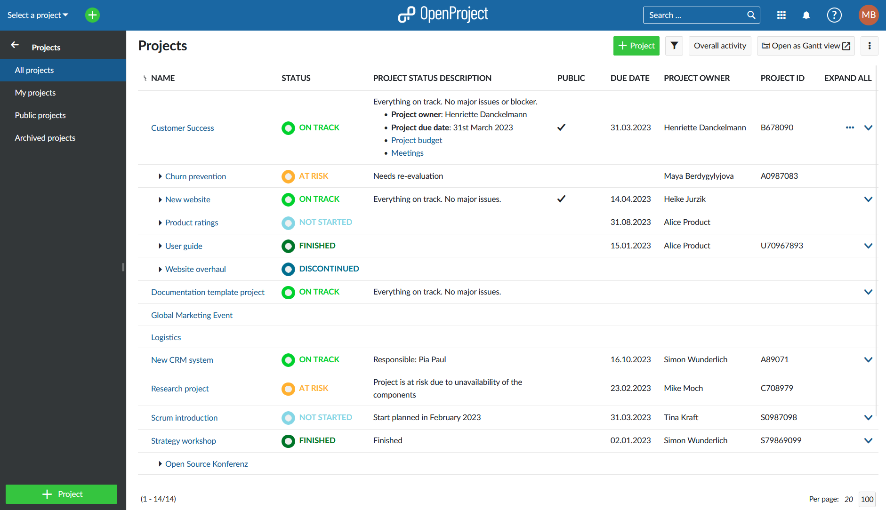
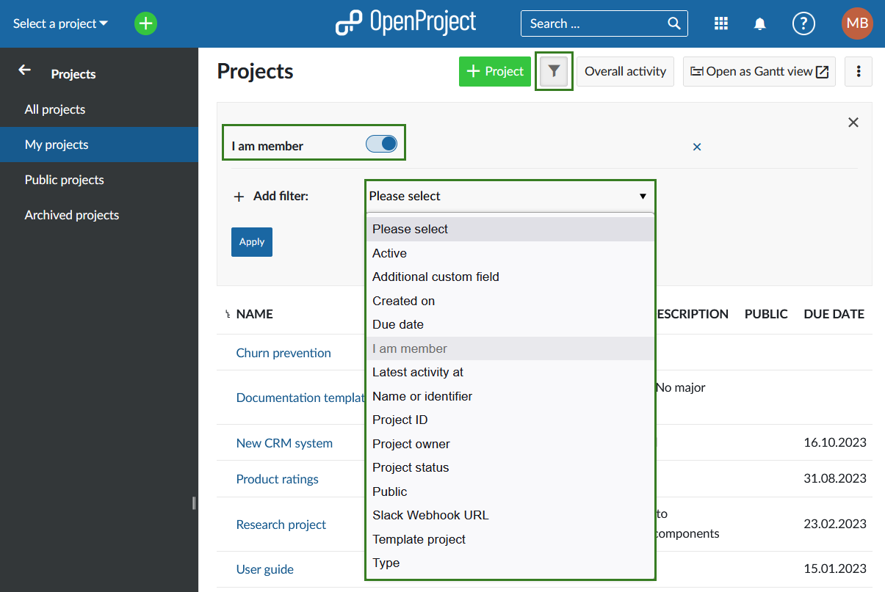
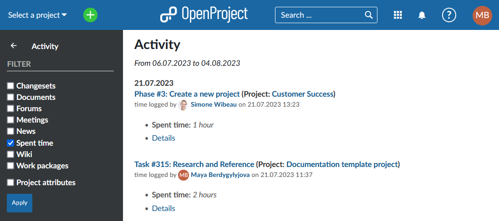

---
sidebar_navigation:
  title: Global modules
  priority: 999
description: Global modules in OpenProject
keywords: global modules, project overarching modules, global index pages
---
# Global modules

Global modules present an overview of the projects that you are a member of or have permissions to see. Here you will find a summary of all the entries in the respective modules across your projects, such as **Activity, Work packages, Calendars, Boards**, etc.

To find **Global modules** menu simply click on the logo in the header of the application, it will be displayed on the left side. 

> It is possible that some of the global modules are not displayed for you. This will be the case if said module is not activated in the [Project settings](../../projects/project-settings/) in any of the active projects in you instance. If for example **News** module is not enabled for any of the active projects, you will not see it in the **Global modules** menu. 

## Projects

**Projects** global module will display a list of the projects that exist in your OpenProject instance, which you are a member of and/or have the right to see (for example as an administrator) and public projects.

You can create a new project here directly by using the  **+ Project** button at the bottom of the left side menu.

On the left you will have the following options:

**All projects** is the default view and shows only active projects. If you do not have administrator rights, this view will be the same as **My projects** for you.

**My projects** is the view that will show projects you are a member of and public projects. When this menu entry is selected, an **I am member** filter will be activated under Filters. You can then add various other filters to adjust the view.

**Public projects** will list all projects that have been set to be public.

**Archived projects**  will list all archived projects that you were a member of or have the right to see.

>Note: you can also navigate to the **Projects** through [**Select a project** dropdown menu](https://www.openproject.org/docs/user-guide/projects/#projects-list ) and by clicking on **View all projects** button in the **Projects** block on the home page.

## Activity

**Activity**  global module provide an overview of all project activities across the projects you are a member of, have the rights to see and public projects. 

The timeframe for tracing and displaying activities starts with the current date. You can adjust how far back the activities should be traced by adjusting [System settings](../../../system-admin-guide/system-settings/general-settings/).

You can adjust the view by selecting respective filters on the left and clicking the **Apply** button. 

>Note: **Changesets** filter comes from repositories that are managed by OpenProject. For example, if you make a commit to a GIT or SVN repository, these changes will be displayed here. At the moment this filter is only relevant for self-hosted editions.

## Work packages

**Work packages** global module will show a list of all the work packages from the projects you are a member of and all public projects. You can select your **Favorite** and **Default** work package filters in the left side menu.

PUBLIC - ???

If you double-click on any of the work packages from the work package table in the **Work packages** global module, the full view of the work package will include highlighted information on which project this particular work package belongs to. 

## Calendars

**Calendars** global module displays all calendars that you have rights to see and all public calendars. 

You can also create a new calendar directly from the global modules menu by clicking the green **+Calendar** button. 

Here you can name the calendar, select a project to which a calendar should be assigned to and set to be public or favored. Find out more about editing calendars [here](../../calendar). 

## Team planners

**Team planners** global module will display all team planners from the projects you are a member of, have administrative privileges to see and the public ones. 

You can also create a new team planner directly from the global modules menu by clicking the green **+Team planner** button. 

Here you can name the team planner, select a project to which a team planner should be assigned to and set to be public or favored. Find out more about editing team planners [here](../../team-planner). 

## Boards

**Boards** global module will list all boards that have been created in the projects you are a member of, have administrative privileges to see or public projects. 

You can also create a board directly from the global modules menu by clicking the green **+Board** button. 

Here you can name the board, select a project to which a board should be assigned to and choose the board type. Find out more about editing boards [here](../../agile-boards). 

## News

**News** global module will display all news that have been published in projects you are a member of, have administrative privileges to see and public projects. 

TIMEFRAME - ?

Read more about writing, editing and commenting on **News** in OpenProject [here](../../news).

## Time and costs

**Time and costs** global module will list time and cost reports created by you and the ones set to be public in the left hand menu. The filters you see initially will be pre-filled based on the values you used for filtering during your last session. You can create new time and cost reports by adjusting filters, grouping criteria and units accordingly and clicking **Apply** button. Do not forget to **Save** your report. 

Read more about creating and editing **Time and cost reports** [here](../../time-and-costs/reporting/).

## Meetings

**Meetings** global module will provide a list of all upcoming an past meetings you have created, been invited to, attended or have administrative privileges to see. The default view will show the **Upcoming meetings**. The most current meetings are shown on top of the list. 

You can also choose to see all **Past meetings** or apply one of the filters based on your **Involvement** in a meeting. 

You can create a new meeting directly from within the global modules menu by clicking a green ***Meeting** button either in the top right corner at the bottom of the sidebar. 

Here you can set the title and select participants, location, time and date of the meeting. Depending on the project you choose from the drop-down menu the list of project members will appear, allowing you to select appropriate participants to invite. Once you click **Create** button you will be able to edit the **Meeting agenda**.

Read more about creating and editing **Meetings** [here](../../meetings).
