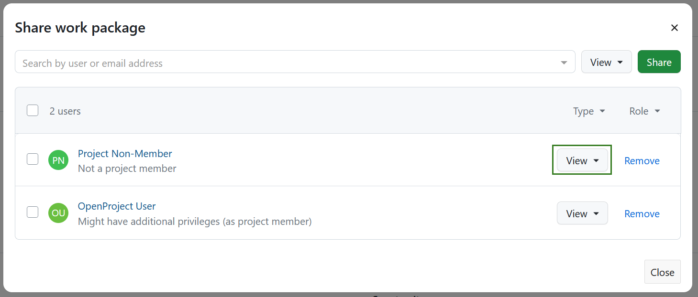

---
sidebar_navigation:
  title: Share work packages
  priority: 963
description: How to share work packages in OpenProject.
keywords: work package, share, share work packages
---

# Share work packages

Since the 13.1 it is possible to share work packages with users that are not members of a project or are not yet registered on your instance. In the latter case a user will need to register in order to view the work package.

> **Note**: Sharing work packages with non-member is an Enterprise add-on and can only be used with [Enterprise cloud](../../../enterprise-guide/enterprise-cloud-guide/) or  [Enterprise on-premises](../../../enterprise-guide/enterprise-on-premises-guide/). An upgrade from the free community edition is easy and helps support OpenProject.

To share a work package with a project non-member select the detailed view of a work package and click the **Share** button.

A dialogue window will open, showing the list of all users, who this work package has already been shared with. If the work package has not yet been shared, the list will empty. 

> **Note**: For sharing with non members to be available, a respective role needs to be assigned to the **Non member role**. 

If the list contains multiple users you can filter it by Type or Role. 

Following user types are available as filters:

- Project member - returns all users that are project members
- Not project member - returns all users that are not project members
- Project group - returns all users that are members of the group, which includes the project
- Not project group - returns all users that are not members of the group, which includes the project

Following user roles are available as filters:

You can search for a user via a user name or an email address. You can either select an existing user from the dropdown menu or enter an email address for an entirely new user, who will receive an invitation to create an account on your instance.

A user with whom you shared the work package will be added to the members of the project with the role **Work Package Viewer** and will be visible in the list of the project members. IS THIS TRUE? THEN WHY ARE THERE NON-PROJECT MEMBER ROLES AVAILABLE AS FILTERS? 

Users with whom you shared the work package will also receive an email notification alerting them that the work package has been shared.

You can always adjust the viewing rights of a user by selecting an option from the dropdown menu next to the user name. 

You can also remove the user from the list by clicking on **Remove** next to the user name. Please not that this will not remove a user entirely, but only revoke the viewing and/or editing rights for the work package. User account will remain intact. If you need to [delete a user](../../../system-admin-guide/users-permissions/users/#delete-users), please do that in system administration or contact your administrator.
