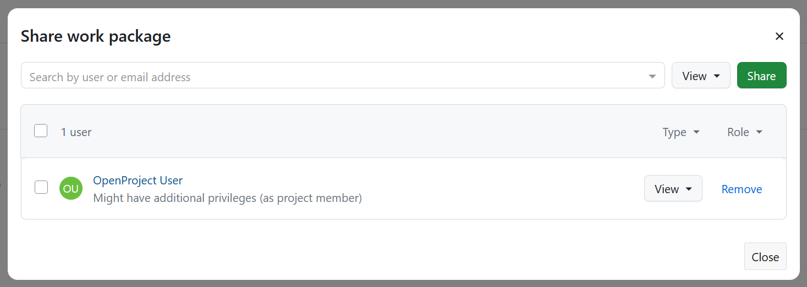
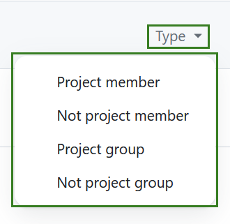

---
sidebar_navigation:
  title: Share work packages
  priority: 963
description: How to share work packages in OpenProject.
keywords: work package, share, share work packages
---

# Share work packages (Enterprise add-on)

It is possible to share work packages with users that are not members of a project or are not yet registered on your instance. In the latter case a user will need to register in order to view the work package.

> **Note**: Sharing work packages with non-member is an Enterprise add-on and can only be used with [Enterprise cloud](../../../enterprise-guide/enterprise-cloud-guide/) or  [Enterprise on-premises](../../../enterprise-guide/enterprise-on-premises-guide/). An upgrade from the free community edition is easy and helps support OpenProject.

## Share a work package

To share a work package with a project non-member select the detailed view of a work package and click the **Share** button.

A dialogue window will open, showing the list of all users, who this work package has already been shared with. If the work package has not yet been shared, the list will be empty. 

> **Note**: In order to be able to share a work package with non members you need to have been assigned a [global role *create users*](./././system-admin-guide/users-permissions/users/#create-users). If you do not see the option to share a work package, please contact your administrator.

If the list contains multiple users you can filter it by Type or Role. 

Following user types are available as filters:

- Project member - returns all users that are project members

- Not project member - returns all users that are not project members

- Project group - returns all users that are members of a group which is part of the project

- Not project group - returns all users that are members of a group which is not part of the project

  

Following user roles are available as filters:

- Edit - returns all users that are permitted to edit a work package
- Comment - returns all users that are allowed to add comments to a work package
- View - returns all users that can view, but not edit or comment on a work package

> **Note:** Please keep in mind that users listed after you have applied a filter may have additional permissions. For example if you select the **View** filter, it is possible that a user is listed, which has inherited additional role as part of user group with permissions exceeding the viewing ones.

You can search for a user or a group via a user name, group name or an email address. You can either select an existing user from the dropdown menu or enter an email address for an entirely new user, who will receive an invitation to create an account on your instance. 

It is possible to add multiple users or groups at the same time.

A user with whom you shared the work package will be added with the role **Work Package Viewer**. However this user is **not** automatically a member of the whole project. A project member will typically have more permissions within the project than viewing a work package. 

Users with whom you shared the work package will also receive an email notification alerting them that the work package has been shared.

You can always adjust the viewing rights of a user by selecting an option from the dropdown menu next to the user name. 

> **Note:** granting the **edit** rights to the user will allow you to set this user a work package **Assignee** or **Accountable**. 

## Remove sharing privileges

You can also remove the user from the list by clicking on **Remove** next to the user name. Please note that this will not remove a user entirely, but only revoke the viewing and/or editing rights for the work package. User account will remain intact. If you need to [delete a user](../../../system-admin-guide/users-permissions/users/#delete-users), please do that in system administration or contact your administrator.

## Shared work packages overview

For an overview of all work packages that have been shared with other users or groups, navigate to the [global modules](../../home/global-modules/), select the module **Work Packages** and choose the filter **Shared with users** from the list of default work package filters on the left side. 

If you want to see all shared work packages within a specific project, navigate to that project first and then select the same filter. You can also [adjust this filter](../work-package-table-configuration/#filter-work-packages) and save it under your private work package filters.

You (with the correct permissions) can always change or remove sharing options. 

## Configuration

Users with the edit role can update most of the attributes of a shared work package (e.g. 'Subject' and 'Description') and this includes the status. A change in status is governed by the workflows configured for the role the user has. An administrator will therefore have to setup the necessary workflows once. A message at the bottom of the screen will notify administrators of this:

To do so, an administrator can follow the link in the message to get to the form for copying workflows. In that form, select the source type (e.g. 'Task') and source role (e.g. 'Member') to copy the workflow from. Afterwards, select the target (e.g. 'Task') and lastly the role which will be 'Work package editor' to copy the workflow for:

You can also choose to use the workflows for the source type and role as the blueprint for multiple target types at the same time.

The copy of a workflow can later on be altered to better reflect the desired transitions between statuses for the edit role. You can also create the desired workflows from scratch.
